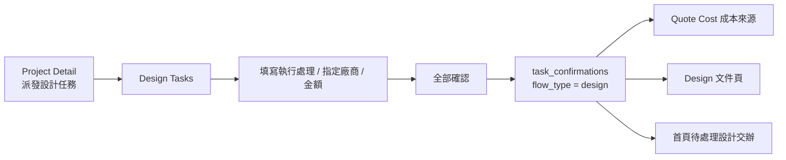

# 設計線

```mermaid
flowchart LR
    A[Project Detail\n派發設計任務] --> B[Design Tasks]
    B --> C[填寫執行處理 / 指定廠商 / 金額]
    C --> D[全部確認]
    D --> E[task_confirmations\nflow_type = design]
    E --> F[Quote Cost 成本來源]
    E --> G[Design 文件頁]
    E --> H[首頁待處理設計交辦]
```

## 你要看的重點

- 設計線不是只要有回覆就成立。
- **按下全部確認** 才會正式承接。
- 首頁 `待處理設計交辦` 也是看有沒有 confirmed confirmation，不是單純 task status。

## 會影響哪裡

1. `Quote Cost`
2. `Design 文件頁`
3. `首頁待處理設計交辦`
