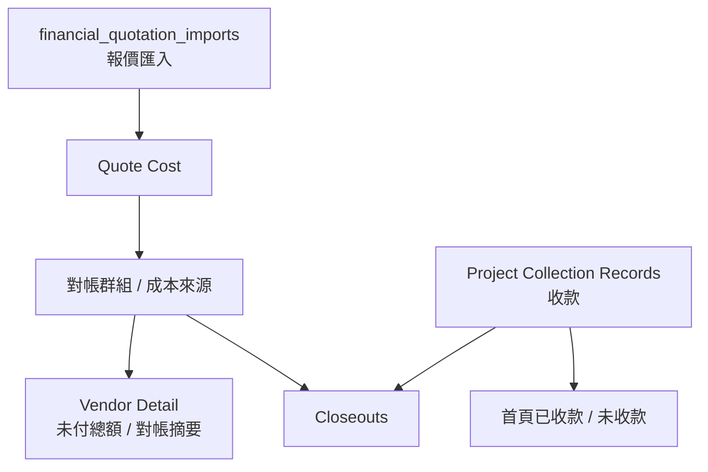

# 財務 / 報價 / 結案線

## 你要看的重點

### 1. Quote Cost 是成本閉環中樞
設計 / 備品 / 廠商三條線確認後，最終都會影響成本面。

### 2. Vendor Detail 的未付總額
現在已對齊成：
- **跨所有專案加總的「已對帳但未付款」總額**
- 不再只是直接 sum reconciliation group amount_total

### 3. Vendor Detail 的付款狀態
現在已改成只剩：
- `未付款`
- `已付款`

不再有 `部分付款`。

### 4. Closeout 是最終彙總頁
它會讀：
- 報價
- 成本
- 收款
- retained snapshot

## 你可以怎麼看

如果你想追某個數字從哪裡來：
1. 先看它是不是 `報價`、`成本`、`對帳`、`收款`
2. 再回頭找它是從哪一條線確認進來的
