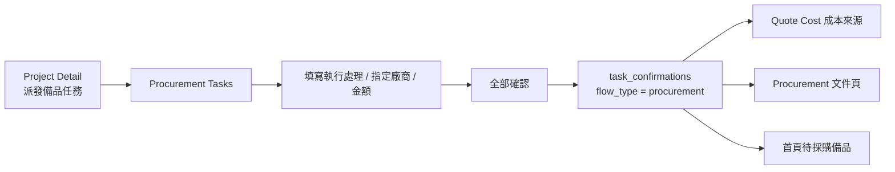

# 備品線

```mermaid
flowchart LR
    A[Project Detail\n派發備品任務] --> B[Procurement Tasks]
    B --> C[填寫執行處理 / 指定廠商 / 金額]
    C --> D[全部確認]
    D --> E[task_confirmations\nflow_type = procurement]
    E --> F[Quote Cost 成本來源]
    E --> G[Procurement 文件頁]
    E --> H[首頁待採購備品]
```

## 你要看的重點

- 備品線和設計線規則一樣。
- 核心節點也是 `全部確認`。
- 首頁 `待採購備品` 已改成看 confirmation，不是只看 status。

## 會影響哪裡

1. `Quote Cost`
2. `Procurement 文件頁`
3. `首頁待採購備品`
