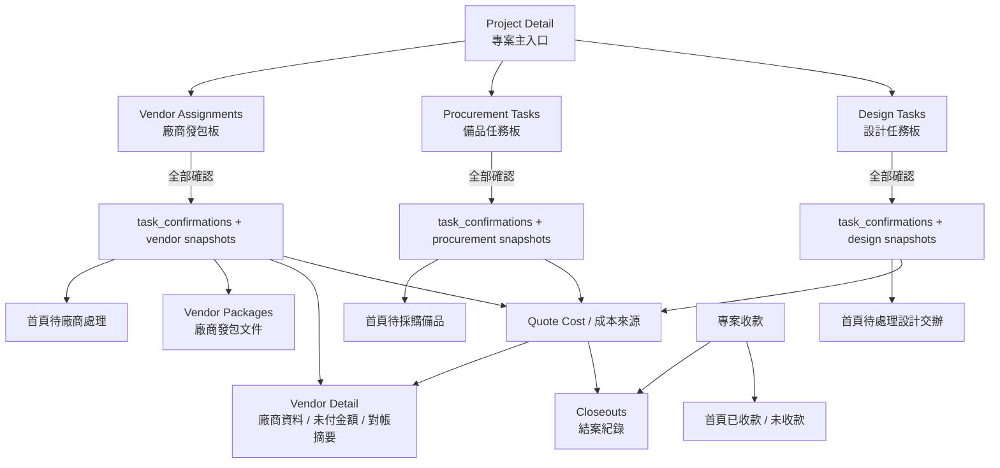

# 主流程總圖

## 一句話版

- `Project Detail` 是任務發布與總入口。
- `Design / Procurement / Vendor` 三條線各自工作。
- 真正正式成立的節點是 `全部確認`。
- 一旦確認，資料才會承接到：
  - `Quote Cost`
  - `Vendor Detail`
  - `Vendor Packages`
  - `Closeouts`
  - `首頁 summary`

## 最重要的閱讀規則

### 1. 還沒全部確認
代表：
- 還在任務板內部處理
- 不算正式承接完成

### 2. 已全部確認
代表：
- `task_confirmations` / `snapshots` 成立
- 下游頁面開始有正式可讀資料

### 3. Vendor 線是另外一條正式承接線
Vendor 線除了進 `Quote Cost`，還會直接影響：
- `Vendor Detail`
- `Vendor Packages`
