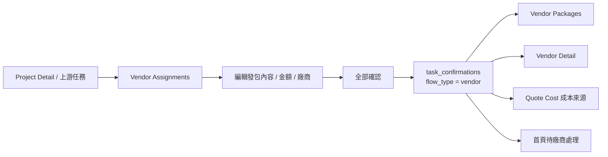

# 廠商線

## 你要看的重點

### 1. 同一廠商不代表只會有 1 筆內容
如果同一個廠商承接了 3 筆 task / plan：
- 廠商還是同一個
- 但內容筆數可以是 3 筆

### 2. 對帳群組數 和 內容筆數 是兩層
- `已對帳群組 X 筆 / 未對帳群組 Y 筆` → 群組層
- `X 筆發包內容` → 內容層

### 3. 再次全部確認現在是覆蓋舊 confirmed data
目前已改成：
- 如果內容沒變，沿用舊 confirmation
- 如果內容變了，先刪舊 confirmed snapshots / confirmations，再寫最新

## 會影響哪裡

1. `Vendor Packages`
2. `Vendor Detail`
3. `Quote Cost`
4. `首頁待廠商處理`
